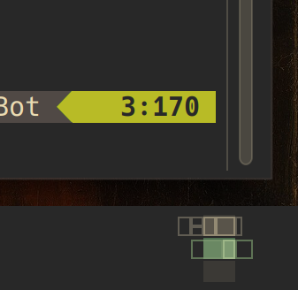

# Karousel Pager

A Plasma 6 pager widget that shows the windows which the
[Karousel](https://github.com/peterfajdiga/karousel) scrolling tiling KWin
script has scrolled out of the viewport.

The stock Plasma pager only draws the windows that are currently visible on
screen. When Karousel scrolls a desktop, the windows that move off the edge
simply disappear from the pager, so it no longer reflects the state of the
whole "tape". This widget reserves extra horizontal space on either side of
each desktop and draws those off-screen windows there as lighter, unfilled
outlines. A window that is only partially scrolled off keeps its normal fill
and outline inside the desktop viewport, and is drawn as a light outline
outside of it.



## Requirements

- Plasma 6
- The [Karousel](https://github.com/peterfajdiga/karousel) KWin script
- Development packages for building.

On openSUSE Tumbleweed:

```sh
sudo zypper install kf6-extra-cmake-modules kf6-kconfig-devel kf6-kwindowsystem-devel \
    libplasma6-devel plasma6-activities-devel plasma6-workspace-devel \
    qt6-base-devel qt6-declarative-devel
```

In general you need `extra-cmake-modules`, the Plasma development files
(`libplasma`, `PlasmaActivities`) and the `plasma-workspace` development files
that provide `LibTaskManager`.

## Building and installing

```sh
cmake -B build -G Ninja -DCMAKE_INSTALL_PREFIX=/usr
cmake --build build
sudo cmake --install build
```

To try it without installing, point Plasma at the build tree instead
(the plugin ends up under `build/lib/plasma/applets`):

```sh
QT_PLUGIN_PATH="$PWD/build/lib" plasmashell --replace
```

Then add the "Karousel Pager" widget to a panel from Plasma's widget
explorer, or replace your existing Pager.

## Configuration

The widget's settings page has the usual pager options plus:

- **Reserved space per side** – how much empty space to reserve on each side
  of a desktop for off-screen windows, measured in desktop widths. The
  default is `1.5`, which makes the widget four desktop widths wide in
  total. Windows that extend beyond the reserved area are faded out.

## How it works

Karousel positions windows with their real `frameGeometry`, so a window that
has been scrolled off the viewport is simply placed outside the screen bounds.
The pager's `WindowModel` used to clamp each window's geometry to the screen
rectangle, which is why off-screen windows were invisible. This widget removes
that clamp and lets the QML clip the geometry instead:

- a masked "ghost" layer draws every window as a light, unfilled outline,
  clipped to the reserved margins and faded towards their outer edges;
- a clipped "solid" layer draws every window with its normal fill and border,
  clipped to the desktop viewport.

Because the two layers share the same (unclamped) geometry, a partially
visible window lines up perfectly across the viewport boundary.

## License

GPL-2.0-or-later. Derived from the Plasma pager applet in
[plasma-desktop](https://invent.kde.org/plasma/plasma-desktop).
